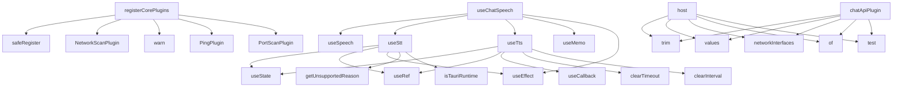

# System Architecture Analysis

## Overview

- **Project**: /home/tom/github/broxeen/broxeen
- **Primary Language**: typescript
- **Languages**: typescript: 169, rust: 43, shell: 10, javascript: 5, python: 2
- **Analysis Mode**: static
- **Total Functions**: 3697
- **Total Classes**: 444
- **Modules**: 229
- **Entry Points**: 2785

## Architecture by Module

### src.plugins.monitor.monitorPlugin
- **Functions**: 300
- **Classes**: 4
- **File**: `monitorPlugin.ts`

### src.plugins.discovery.networkScanPlugin
- **Functions**: 197
- **Classes**: 3
- **File**: `networkScanPlugin.ts`

### src.lib.browseGateway
- **Functions**: 183
- **Classes**: 3
- **File**: `browseGateway.ts`

### scripts.chat-cli
- **Functions**: 156
- **File**: `chat-cli.mjs`

### src.plugins.protocol-bridge.protocolBridgePlugin
- **Functions**: 152
- **Classes**: 7
- **File**: `protocolBridgePlugin.ts`

### src.plugins.camera.cameraLivePlugin
- **Functions**: 72
- **Classes**: 1
- **File**: `cameraLivePlugin.ts`

### src.hooks.useStt
- **Functions**: 62
- **Classes**: 2
- **File**: `useStt.ts`

### src.components.CameraPreview
- **Functions**: 62
- **Classes**: 2
- **File**: `CameraPreview.tsx`

### src.plugins.monitor.motionDetectionPlugin
- **Functions**: 58
- **Classes**: 4
- **File**: `motionDetectionPlugin.ts`

### src.hooks.useChatDispatch
- **Functions**: 56
- **Classes**: 1
- **File**: `useChatDispatch.ts`

### src.plugins.toonic.toonicBridgePlugin
- **Functions**: 54
- **Classes**: 3
- **File**: `toonicBridgePlugin.ts`

### src.hooks.useTts
- **Functions**: 51
- **Classes**: 3
- **File**: `useTts.ts`

### scripts.net-diag
- **Functions**: 51
- **File**: `net-diag.mjs`

### src.reactive.watchManager
- **Functions**: 44
- **Classes**: 1
- **File**: `watchManager.ts`

### src.components.Chat
- **Functions**: 44
- **Classes**: 1
- **File**: `Chat.tsx`

### vite.config
- **Functions**: 42
- **File**: `vite.config.ts`

### src.plugins.discovery.advancedPortScanPlugin
- **Functions**: 42
- **Classes**: 1
- **File**: `advancedPortScanPlugin.ts`

### src.plugins.rtsp-camera.rtspCameraPlugin
- **Functions**: 42
- **Classes**: 9
- **File**: `rtspCameraPlugin.ts`

### src.plugins.discovery.deviceConfigPlugin
- **Functions**: 42
- **Classes**: 1
- **File**: `deviceConfigPlugin.ts`

### src.plugins.discovery.deviceStatusPlugin
- **Functions**: 41
- **Classes**: 1
- **File**: `deviceStatusPlugin.ts`

## Key Entry Points

Main execution flows into the system:

### src.core.bootstrap.registerCorePlugins
- **Calls**: src.core.bootstrap.safeRegister, src.core.bootstrap.NetworkScanPlugin, src.core.bootstrap.warn, src.core.bootstrap.PingPlugin, src.core.bootstrap.PortScanPlugin, src.core.bootstrap.OnvifPlugin, src.core.bootstrap.MdnsPlugin, src.core.bootstrap.ArpPlugin

### src.hooks.useChatSpeech.useChatSpeech
- **Calls**: src.hooks.useChatSpeech.useSpeech, src.hooks.useChatSpeech.useStt, src.hooks.useChatSpeech.useTts, src.hooks.useChatSpeech.useMemo, src.hooks.useChatSpeech.useEffect, src.hooks.useChatSpeech.stop, src.hooks.useChatSpeech.appendStatusNotice, src.hooks.useChatSpeech.info

### src.hooks.useTts.useTts
- **Calls**: src.hooks.useTts.useState, src.hooks.useTts.useRef, src.hooks.useTts.useCallback, src.hooks.useTts.clearTimeout, src.hooks.useTts.clearInterval, src.hooks.useTts.clearBackendProgress, src.hooks.useTts.now, src.hooks.useTts.setProgress

### src.hooks.useStt.useStt
- **Calls**: src.hooks.useStt.useState, src.hooks.useStt.useRef, src.hooks.useStt.useEffect, src.hooks.useStt.getUnsupportedReason, src.hooks.useStt.isTauriRuntime, src.hooks.useStt.setMode, src.hooks.useStt.setIsSupported, src.hooks.useStt.setUnsupportedReason

### vite.config.host
- **Calls**: vite.config.trim, vite.config.values, vite.config.networkInterfaces, vite.config.of, vite.config.test, vite.config.run, vite.config.split, vite.config.map

### vite.config.chatApiPlugin
- **Calls**: vite.config.trim, vite.config.values, vite.config.networkInterfaces, vite.config.of, vite.config.test, vite.config.run, vite.config.split, vite.config.map

### src.hooks.useChatDispatch.useChatDispatch
- **Calls**: src.hooks.useChatDispatch.useCallback, src.hooks.useChatDispatch.trim, src.hooks.useChatDispatch.debug, src.hooks.useChatDispatch.addScopePrefix, src.hooks.useChatDispatch.setShowCommandHistory, src.hooks.useChatDispatch.setInput, src.hooks.useChatDispatch.info, src.hooks.useChatDispatch.store

### src-tauri.src.vision_pipeline.start
- **Calls**: src-tauri.src.vision_pipeline.let, src-tauri.src.vision_pipeline.channel, src-tauri.src.vision_pipeline.open, src-tauri.src.vision_pipeline.from_config, src-tauri.src.vision_pipeline.clone, src-tauri.src.vision_pipeline.batching, src-tauri.src.vision_pipeline.spawn, src-tauri.src.vision_pipeline.try_recv

### src-tauri.src.network_scan.ensure_rtsp_worker
- **Calls**: src-tauri.src.network_scan.rtsp_workers, src-tauri.src.network_scan.lock, src-tauri.src.network_scan.expect, src-tauri.src.network_scan.Some, src-tauri.src.network_scan.get, src-tauri.src.network_scan.clone, src-tauri.src.network_scan.to_string, src-tauri.src.network_scan.spawn

### src.plugins.discovery.deviceConfigPlugin.configLogger
- **Calls**: src.plugins.discovery.deviceConfigPlugin.DeviceConfigPlugin.initialize, src.plugins.discovery.deviceConfigPlugin.warn, src.plugins.discovery.deviceConfigPlugin.ConfiguredDeviceRepository, src.plugins.discovery.deviceConfigPlugin.getDevicesDb, src.plugins.discovery.deviceConfigPlugin.info, src.plugins.discovery.deviceConfigPlugin.DeviceConfigPlugin.resolveRoute, src.plugins.discovery.deviceConfigPlugin.toLowerCase, src.plugins.discovery.deviceConfigPlugin.some

### src.plugins.discovery.networkScanPlugin.NetworkScanPlugin.execute
- **Calls**: src.plugins.discovery.networkScanPlugin.NetworkScanPlugin.now, src.plugins.discovery.networkScanPlugin.NetworkScanPlugin.isStatusQuery, src.plugins.discovery.networkScanPlugin.NetworkScanPlugin.handleDeviceStatus, src.plugins.discovery.networkScanPlugin.NetworkScanPlugin.isFilterQuery, src.plugins.discovery.networkScanPlugin.NetworkScanPlugin.handleDeviceFilter, src.plugins.discovery.networkScanPlugin.NetworkScanPlugin.isExportQuery, src.plugins.discovery.networkScanPlugin.NetworkScanPlugin.handleExport, src.plugins.discovery.networkScanPlugin.toLowerCase

### src.components.ChatInput.ChatInput
- **Calls**: src.components.ChatInput.useState, src.components.ChatInput.useMemo, src.components.ChatInput.trim, src.components.ChatInput.toLowerCase, src.components.ChatInput.getRecentQueries, src.components.ChatInput.startsWith, src.components.ChatInput.includes, src.components.ChatInput.has

### src-tauri.src.file_search.search_with_rust_search
- **Calls**: src-tauri.src.file_search.is_empty, src-tauri.src.file_search.join, src-tauri.src.file_search.location, src-tauri.src.file_search.to_str, src-tauri.src.file_search.unwrap_or, src-tauri.src.file_search.search_input, src-tauri.src.file_search.depth, src-tauri.src.file_search.ignore_case

### src-tauri.src.wake_word.start_wake_word_listening
- **Calls**: src-tauri.src.wake_word.default_host, src-tauri.src.wake_word.default_input_device, src-tauri.src.wake_word.ok_or, src-tauri.src.wake_word.device, src-tauri.src.wake_word.name, src-tauri.src.wake_word.unwrap_or_else, src-tauri.src.wake_word.into, src-tauri.src.wake_word.default_input_config

### src.config.configStore.configLogger
- **Calls**: src.config.configStore.Set, src.config.configStore.constructor, src.config.configStore.ConfigStoreImpl.load, src.config.configStore.info, src.config.configStore.getItem, src.config.configStore.parse, src.config.configStore.debug, src.config.configStore.warn

### src.hooks.useStt.startRecording
- **Calls**: src.hooks.useStt.useCallback, src.hooks.useStt.logSyncDecorator, src.hooks.useStt.setError, src.hooks.useStt.setLastErrorDetails, src.hooks.useStt.setTranscript, src.hooks.useStt.setCurrentMode, src.hooks.useStt.debug, src.hooks.useStt.startTauriRecording

### src.components.ErrorReportPanel.ErrorReportPanel
- **Calls**: src.components.ErrorReportPanel.useState, src.components.ErrorReportPanel.getErrorStats, src.components.ErrorReportPanel.getErrors, src.components.ErrorReportPanel.useEffect, src.components.ErrorReportPanel.refreshData, src.components.ErrorReportPanel.setStats, src.components.ErrorReportPanel.setErrors, src.components.ErrorReportPanel.getFilterOptions

### src.components.ChatMessageList.ChatMessageList
- **Calls**: src.components.ChatMessageList.markdownComponents, src.components.ChatMessageList.renderer, src.components.ChatMessageList.map, src.components.ChatMessageList.onSubmit, src.components.ChatMessageList.onSetInput, src.components.ChatMessageList.onShowCommandHistory, src.components.ChatMessageList.getRecentQueries, src.components.ChatMessageList.getCurrentContext

### src.plugins.discovery.deviceStatusPlugin.statusLogger
- **Calls**: src.plugins.discovery.deviceStatusPlugin.DeviceStatusPlugin.initialize, src.plugins.discovery.deviceStatusPlugin.warn, src.plugins.discovery.deviceStatusPlugin.DeviceRepository, src.plugins.discovery.deviceStatusPlugin.getDevicesDb, src.plugins.discovery.deviceStatusPlugin.info, src.plugins.discovery.deviceStatusPlugin.DeviceStatusPlugin.canHandle, src.plugins.discovery.deviceStatusPlugin.toLowerCase, src.plugins.discovery.deviceStatusPlugin.some

### src-tauri.src.tts.tts_speak
- **Calls**: src-tauri.src.tts.trim, src-tauri.src.tts.to_string, src-tauri.src.tts.is_empty, src-tauri.src.tts.Err, src-tauri.src.tts.load_settings, src-tauri.src.tts.backend_info, src-tauri.src.tts.backend_warn, src-tauri.src.tts.detect_backend

### src.hooks.useSpeech.useSpeech
- **Calls**: src.hooks.useSpeech.useState, src.hooks.useSpeech.useRef, src.hooks.useSpeech.useEffect, src.hooks.useSpeech.isTauriRuntime, src.hooks.useSpeech.getSpeechRecognitionCtor, src.hooks.useSpeech.getUnsupportedReason, src.hooks.useSpeech.info, src.hooks.useSpeech.warn

### src-tauri.src.browse_rendered.render_and_extract
- **Calls**: src-tauri.src.browse_rendered.detect_chrome_binary, src-tauri.src.browse_rendered.ok_or_else, src-tauri.src.browse_rendered.to_string, src-tauri.src.browse_rendered.backend_info, src-tauri.src.browse_rendered.arg, src-tauri.src.browse_rendered.0, src-tauri.src.browse_rendered.36, src-tauri.src.browse_rendered.output

### src.persistence.deviceRepository.repoLogger
- **Calls**: src.persistence.deviceRepository.constructor, src.persistence.deviceRepository.saveDevice, src.persistence.deviceRepository.DeviceRepository.now, src.persistence.deviceRepository.execute, src.persistence.deviceRepository.devices, src.persistence.deviceRepository.DeviceRepository.VALUES, src.persistence.deviceRepository.CONFLICT, src.persistence.deviceRepository.DeviceRepository.COALESCE

### src.App.micStreamRef
- **Calls**: src.App.useEffect, src.App.info, src.App.isTauriRuntime, src.App.logAsyncDecorator, src.App.runQuickHealthCheck, src.App.warn, src.App.error, src.App.bootstrapApp

### src.App.micAudioCtxRef
- **Calls**: src.App.useEffect, src.App.info, src.App.isTauriRuntime, src.App.logAsyncDecorator, src.App.runQuickHealthCheck, src.App.warn, src.App.error, src.App.bootstrapApp

### src.App.micAnimationFrameRef
- **Calls**: src.App.useEffect, src.App.info, src.App.isTauriRuntime, src.App.logAsyncDecorator, src.App.runQuickHealthCheck, src.App.warn, src.App.error, src.App.bootstrapApp

### src-tauri.src.logging.init_logging
- **Calls**: src-tauri.src.logging.call_once, src-tauri.src.logging.let, src-tauri.src.logging.Some, src-tauri.src.logging.build_file_appender, src-tauri.src.logging.non_blocking, src-tauri.src.logging.layer, src-tauri.src.logging.with_ansi, src-tauri.src.logging.with_target

### scripts.net-diag.main
- **Calls**: scripts.net-diag.getLocalIp, scripts.net-diag.split, scripts.net-diag.slice, scripts.net-diag.join, scripts.net-diag.log, scripts.net-diag.col, scripts.net-diag.repeat, scripts.net-diag.printTools

### src-tauri.src.vision_db.execute_query
- **Calls**: src-tauri.src.vision_db.trim, src-tauri.src.vision_db.to_uppercase, src-tauri.src.vision_db.starts_with, src-tauri.src.vision_db.prepare, src-tauri.src.vision_db.column_names, src-tauri.src.vision_db.into_iter, src-tauri.src.vision_db.map, src-tauri.src.vision_db.collect

### src.components.CameraLiveInline.CameraLiveInline
- **Calls**: src.components.CameraLiveInline.max, src.components.CameraLiveInline.useMemo, src.components.CameraLiveInline.round, src.components.CameraLiveInline.get, src.components.CameraLiveInline.useState, src.components.CameraLiveInline.useRef, src.components.CameraLiveInline.useEffect, src.components.CameraLiveInline.setFrame

## Process Flows

Key execution flows identified:

### Flow 1: registerCorePlugins
```
registerCorePlugins [src.core.bootstrap]
  └─> safeRegister
```

### Flow 2: useChatSpeech
```
useChatSpeech [src.hooks.useChatSpeech]
```

### Flow 3: useTts
```
useTts [src.hooks.useTts]
```

### Flow 4: useStt
```
useStt [src.hooks.useStt]
```

### Flow 5: host
```
host [vite.config]
```

### Flow 6: chatApiPlugin
```
chatApiPlugin [vite.config]
```

### Flow 7: useChatDispatch
```
useChatDispatch [src.hooks.useChatDispatch]
```

### Flow 8: start
```
start [src-tauri.src.vision_pipeline]
```

### Flow 9: ensure_rtsp_worker
```
ensure_rtsp_worker [src-tauri.src.network_scan]
  └─> rtsp_workers
```

### Flow 10: configLogger
```
configLogger [src.plugins.discovery.deviceConfigPlugin]
  └─ →> initialize
```

## Key Classes

### src.plugins.monitor.monitorPlugin.MonitorPlugin
- **Methods**: 300
- **Key Methods**: src.plugins.monitor.monitorPlugin.MonitorPlugin.buildDbConflictPrompt, src.plugins.monitor.monitorPlugin.MonitorPlugin.canHandle, src.plugins.monitor.monitorPlugin.MonitorPlugin.lower, src.plugins.monitor.monitorPlugin.MonitorPlugin.execute, src.plugins.monitor.monitorPlugin.MonitorPlugin.start, src.plugins.monitor.monitorPlugin.MonitorPlugin.lower, src.plugins.monitor.monitorPlugin.MonitorPlugin.m, src.plugins.monitor.monitorPlugin.MonitorPlugin.toggle, src.plugins.monitor.monitorPlugin.MonitorPlugin.parseToggleMonitoring, src.plugins.monitor.monitorPlugin.MonitorPlugin.m

### src.plugins.discovery.networkScanPlugin.NetworkScanPlugin
- **Methods**: 197
- **Key Methods**: src.plugins.discovery.networkScanPlugin.NetworkScanPlugin.resolveRoute, src.plugins.discovery.networkScanPlugin.NetworkScanPlugin.lower, src.plugins.discovery.networkScanPlugin.NetworkScanPlugin.initialize, src.plugins.discovery.networkScanPlugin.NetworkScanPlugin.canHandle, src.plugins.discovery.networkScanPlugin.NetworkScanPlugin.isStatusQuery, src.plugins.discovery.networkScanPlugin.NetworkScanPlugin.isFilterQuery, src.plugins.discovery.networkScanPlugin.NetworkScanPlugin.isExportQuery, src.plugins.discovery.networkScanPlugin.NetworkScanPlugin.extractExportFormat, src.plugins.discovery.networkScanPlugin.NetworkScanPlugin.lower, src.plugins.discovery.networkScanPlugin.NetworkScanPlugin.extractFilterType

### src.plugins.protocol-bridge.protocolBridgePlugin.ProtocolBridgePlugin
- **Methods**: 151
- **Key Methods**: src.plugins.protocol-bridge.protocolBridgePlugin.ProtocolBridgePlugin.resolveRoute, src.plugins.protocol-bridge.protocolBridgePlugin.ProtocolBridgePlugin.lower, src.plugins.protocol-bridge.protocolBridgePlugin.ProtocolBridgePlugin.canHandle, src.plugins.protocol-bridge.protocolBridgePlugin.ProtocolBridgePlugin.lower, src.plugins.protocol-bridge.protocolBridgePlugin.ProtocolBridgePlugin.execute, src.plugins.protocol-bridge.protocolBridgePlugin.ProtocolBridgePlugin.start, src.plugins.protocol-bridge.protocolBridgePlugin.ProtocolBridgePlugin.route, src.plugins.protocol-bridge.protocolBridgePlugin.ProtocolBridgePlugin.autoProtocol, src.plugins.protocol-bridge.protocolBridgePlugin.ProtocolBridgePlugin.detectProtocolFromInput, src.plugins.protocol-bridge.protocolBridgePlugin.ProtocolBridgePlugin.lower

### src.plugins.camera.cameraLivePlugin.CameraLivePlugin
- **Methods**: 72
- **Key Methods**: src.plugins.camera.cameraLivePlugin.CameraLivePlugin.canHandle, src.plugins.camera.cameraLivePlugin.CameraLivePlugin.trimmed, src.plugins.camera.cameraLivePlugin.CameraLivePlugin.execute, src.plugins.camera.cameraLivePlugin.CameraLivePlugin.start, src.plugins.camera.cameraLivePlugin.CameraLivePlugin.sanitizedInput, src.plugins.camera.cameraLivePlugin.CameraLivePlugin.rtspMatch, src.plugins.camera.cameraLivePlugin.CameraLivePlugin.storedPath, src.plugins.camera.cameraLivePlugin.CameraLivePlugin.credMatch, src.plugins.camera.cameraLivePlugin.CameraLivePlugin.ipMatch, src.plugins.camera.cameraLivePlugin.CameraLivePlugin.isReachable

### src.plugins.monitor.motionDetectionPlugin.MotionDetectionPlugin
- **Methods**: 57
- **Key Methods**: src.plugins.monitor.motionDetectionPlugin.MotionDetectionPlugin.initialize, src.plugins.monitor.motionDetectionPlugin.MotionDetectionPlugin.parsed, src.plugins.monitor.motionDetectionPlugin.MotionDetectionPlugin.dispose, src.plugins.monitor.motionDetectionPlugin.MotionDetectionPlugin.canHandle, src.plugins.monitor.motionDetectionPlugin.MotionDetectionPlugin.lower, src.plugins.monitor.motionDetectionPlugin.MotionDetectionPlugin.execute, src.plugins.monitor.motionDetectionPlugin.MotionDetectionPlugin.start, src.plugins.monitor.motionDetectionPlugin.MotionDetectionPlugin.lower, src.plugins.monitor.motionDetectionPlugin.MotionDetectionPlugin.handleStart, src.plugins.monitor.motionDetectionPlugin.MotionDetectionPlugin.rtspUrl

### src.plugins.toonic.toonicBridgePlugin.ToonicBridgePlugin
- **Methods**: 53
- **Key Methods**: src.plugins.toonic.toonicBridgePlugin.ToonicBridgePlugin.canHandle, src.plugins.toonic.toonicBridgePlugin.ToonicBridgePlugin.execute, src.plugins.toonic.toonicBridgePlugin.ToonicBridgePlugin.start, src.plugins.toonic.toonicBridgePlugin.ToonicBridgePlugin.lower, src.plugins.toonic.toonicBridgePlugin.ToonicBridgePlugin.msg, src.plugins.toonic.toonicBridgePlugin.ToonicBridgePlugin.handleStart, src.plugins.toonic.toonicBridgePlugin.ToonicBridgePlugin.status, src.plugins.toonic.toonicBridgePlugin.ToonicBridgePlugin.handleStop, src.plugins.toonic.toonicBridgePlugin.ToonicBridgePlugin.msg, src.plugins.toonic.toonicBridgePlugin.ToonicBridgePlugin.handleStatus

### src.reactive.watchManager.WatchManager
- **Methods**: 44
- **Key Methods**: src.reactive.watchManager.WatchManager.start, src.reactive.watchManager.WatchManager.stop, src.reactive.watchManager.WatchManager.clearInterval, src.reactive.watchManager.WatchManager.now, src.reactive.watchManager.WatchManager.recentQuery, src.reactive.watchManager.WatchManager.cancelWatchRule, src.reactive.watchManager.WatchManager.watchRule, src.reactive.watchManager.WatchManager.loadActiveWatches, src.reactive.watchManager.WatchManager.db, src.reactive.watchManager.WatchManager.now

### src.plugins.discovery.advancedPortScanPlugin.AdvancedPortScanPlugin
- **Methods**: 42
- **Key Methods**: src.plugins.discovery.advancedPortScanPlugin.AdvancedPortScanPlugin.canHandle, src.plugins.discovery.advancedPortScanPlugin.AdvancedPortScanPlugin.lower, src.plugins.discovery.advancedPortScanPlugin.AdvancedPortScanPlugin.execute, src.plugins.discovery.advancedPortScanPlugin.AdvancedPortScanPlugin.start, src.plugins.discovery.advancedPortScanPlugin.AdvancedPortScanPlugin.ipMatch, src.plugins.discovery.advancedPortScanPlugin.AdvancedPortScanPlugin.subnetMatch, src.plugins.discovery.advancedPortScanPlugin.AdvancedPortScanPlugin.targetIp, src.plugins.discovery.advancedPortScanPlugin.AdvancedPortScanPlugin.targetSubnet, src.plugins.discovery.advancedPortScanPlugin.AdvancedPortScanPlugin.result, src.plugins.discovery.advancedPortScanPlugin.AdvancedPortScanPlugin.results

### src.plugins.discovery.deviceConfigPlugin.DeviceConfigPlugin
- **Methods**: 41
- **Key Methods**: src.plugins.discovery.deviceConfigPlugin.DeviceConfigPlugin.initialize, src.plugins.discovery.deviceConfigPlugin.DeviceConfigPlugin.resolveRoute, src.plugins.discovery.deviceConfigPlugin.DeviceConfigPlugin.lower, src.plugins.discovery.deviceConfigPlugin.DeviceConfigPlugin.canHandle, src.plugins.discovery.deviceConfigPlugin.DeviceConfigPlugin.execute, src.plugins.discovery.deviceConfigPlugin.DeviceConfigPlugin.start, src.plugins.discovery.deviceConfigPlugin.DeviceConfigPlugin.lowerInput, src.plugins.discovery.deviceConfigPlugin.DeviceConfigPlugin.listConfiguredDevices, src.plugins.discovery.deviceConfigPlugin.DeviceConfigPlugin.devices, src.plugins.discovery.deviceConfigPlugin.DeviceConfigPlugin.cameras

### src.plugins.discovery.deviceStatusPlugin.DeviceStatusPlugin
- **Methods**: 40
- **Key Methods**: src.plugins.discovery.deviceStatusPlugin.DeviceStatusPlugin.initialize, src.plugins.discovery.deviceStatusPlugin.DeviceStatusPlugin.canHandle, src.plugins.discovery.deviceStatusPlugin.DeviceStatusPlugin.lowerInput, src.plugins.discovery.deviceStatusPlugin.DeviceStatusPlugin.execute, src.plugins.discovery.deviceStatusPlugin.DeviceStatusPlugin.start, src.plugins.discovery.deviceStatusPlugin.DeviceStatusPlugin.lowerInput, src.plugins.discovery.deviceStatusPlugin.DeviceStatusPlugin.showGeneralStatus, src.plugins.discovery.deviceStatusPlugin.DeviceStatusPlugin.start, src.plugins.discovery.deviceStatusPlugin.DeviceStatusPlugin.devicesWithStatus, src.plugins.discovery.deviceStatusPlugin.DeviceStatusPlugin.recentlyActive

### src.plugins.frigate.frigateEventsPlugin.FrigateEventsPlugin
- **Methods**: 38
- **Key Methods**: src.plugins.frigate.frigateEventsPlugin.FrigateEventsPlugin.initialize, src.plugins.frigate.frigateEventsPlugin.FrigateEventsPlugin.cfg, src.plugins.frigate.frigateEventsPlugin.FrigateEventsPlugin.unlisten, src.plugins.frigate.frigateEventsPlugin.FrigateEventsPlugin.dispose, src.plugins.frigate.frigateEventsPlugin.FrigateEventsPlugin.resolveRoute, src.plugins.frigate.frigateEventsPlugin.FrigateEventsPlugin.lower, src.plugins.frigate.frigateEventsPlugin.FrigateEventsPlugin.canHandle, src.plugins.frigate.frigateEventsPlugin.FrigateEventsPlugin.execute, src.plugins.frigate.frigateEventsPlugin.FrigateEventsPlugin.start, src.plugins.frigate.frigateEventsPlugin.FrigateEventsPlugin.route

### src.reactive.changeDetector.ChangeDetector
- **Methods**: 37
- **Key Methods**: src.reactive.changeDetector.ChangeDetector.previousSnapshot, src.reactive.changeDetector.ChangeDetector.changeScore, src.reactive.changeDetector.ChangeDetector.hasChanged, src.reactive.changeDetector.ChangeDetector.changeType, src.reactive.changeDetector.ChangeDetector.newSnapshot, src.reactive.changeDetector.ChangeDetector.db, src.reactive.changeDetector.ChangeDetector.row, src.reactive.changeDetector.ChangeDetector.db, src.reactive.changeDetector.ChangeDetector.now, src.reactive.changeDetector.ChangeDetector.hash

### src.plugins.files.fileSearchPlugin.FileSearchPlugin
- **Methods**: 36
- **Key Methods**: src.plugins.files.fileSearchPlugin.FileSearchPlugin.canHandle, src.plugins.files.fileSearchPlugin.FileSearchPlugin.lower, src.plugins.files.fileSearchPlugin.FileSearchPlugin.execute, src.plugins.files.fileSearchPlugin.FileSearchPlugin.start, src.plugins.files.fileSearchPlugin.FileSearchPlugin.lower, src.plugins.files.fileSearchPlugin.FileSearchPlugin.response, src.plugins.files.fileSearchPlugin.FileSearchPlugin.filePath, src.plugins.files.fileSearchPlugin.FileSearchPlugin.response, src.plugins.files.fileSearchPlugin.FileSearchPlugin.isImage, src.plugins.files.fileSearchPlugin.FileSearchPlugin.truncNote

### src.plugins.email.emailPlugin.EmailPlugin
- **Methods**: 36
- **Key Methods**: src.plugins.email.emailPlugin.EmailPlugin.resolveRoute, src.plugins.email.emailPlugin.EmailPlugin.lower, src.plugins.email.emailPlugin.EmailPlugin.canHandle, src.plugins.email.emailPlugin.EmailPlugin.execute, src.plugins.email.emailPlugin.EmailPlugin.start, src.plugins.email.emailPlugin.EmailPlugin.route, src.plugins.email.emailPlugin.EmailPlugin.isPollConfigRequest, src.plugins.email.emailPlugin.EmailPlugin.handleConfig, src.plugins.email.emailPlugin.EmailPlugin.currentConfig, src.plugins.email.emailPlugin.EmailPlugin.emailConfig

### src.plugins.system.sshPlugin.SshPlugin
- **Methods**: 34
- **Key Methods**: src.plugins.system.sshPlugin.SshPlugin.canHandle, src.plugins.system.sshPlugin.SshPlugin.lower, src.plugins.system.sshPlugin.SshPlugin.execute, src.plugins.system.sshPlugin.SshPlugin.start, src.plugins.system.sshPlugin.SshPlugin.lower, src.plugins.system.sshPlugin.SshPlugin.testHost, src.plugins.system.sshPlugin.SshPlugin.handleExecute, src.plugins.system.sshPlugin.SshPlugin.host, src.plugins.system.sshPlugin.SshPlugin.subnet, src.plugins.system.sshPlugin.SshPlugin.sshCfg

### src.discovery.networkScanner.NetworkScanner
- **Methods**: 33
- **Key Methods**: src.discovery.networkScanner.NetworkScanner.scanNetwork, src.discovery.networkScanner.NetworkScanner.startTime, src.discovery.networkScanner.NetworkScanner.methodResults, src.discovery.networkScanner.NetworkScanner.uniqueDevices, src.discovery.networkScanner.NetworkScanner.scanDuration, src.discovery.networkScanner.NetworkScanner.performScan, src.discovery.networkScanner.NetworkScanner.pingSweep, src.discovery.networkScanner.NetworkScanner.networkRanges, src.discovery.networkScanner.NetworkScanner.promises, src.discovery.networkScanner.NetworkScanner.mdnsDiscovery

### src.plugins.remote-machine.remoteMachinePlugin.RemoteMachinePlugin
- **Methods**: 33
- **Key Methods**: src.plugins.remote-machine.remoteMachinePlugin.RemoteMachinePlugin.initialize, src.plugins.remote-machine.remoteMachinePlugin.RemoteMachinePlugin.dispose, src.plugins.remote-machine.remoteMachinePlugin.RemoteMachinePlugin.canHandle, src.plugins.remote-machine.remoteMachinePlugin.RemoteMachinePlugin.execute, src.plugins.remote-machine.remoteMachinePlugin.RemoteMachinePlugin.intentLower, src.plugins.remote-machine.remoteMachinePlugin.RemoteMachinePlugin.machine, src.plugins.remote-machine.remoteMachinePlugin.RemoteMachinePlugin.handleAddMachine, src.plugins.remote-machine.remoteMachinePlugin.RemoteMachinePlugin.hostMatch, src.plugins.remote-machine.remoteMachinePlugin.RemoteMachinePlugin.userMatch, src.plugins.remote-machine.remoteMachinePlugin.RemoteMachinePlugin.handleListMachines

### src.plugins.system.diskInfoPlugin.DiskInfoPlugin
- **Methods**: 33
- **Key Methods**: src.plugins.system.diskInfoPlugin.DiskInfoPlugin.canHandle, src.plugins.system.diskInfoPlugin.DiskInfoPlugin.lower, src.plugins.system.diskInfoPlugin.DiskInfoPlugin.execute, src.plugins.system.diskInfoPlugin.DiskInfoPlugin.start, src.plugins.system.diskInfoPlugin.DiskInfoPlugin.lower, src.plugins.system.diskInfoPlugin.DiskInfoPlugin.remoteHost, src.plugins.system.diskInfoPlugin.DiskInfoPlugin.buildConfigPrompt, src.plugins.system.diskInfoPlugin.DiskInfoPlugin.highUsage, src.plugins.system.diskInfoPlugin.DiskInfoPlugin.buildProgressBar, src.plugins.system.diskInfoPlugin.DiskInfoPlugin.filled

### src.plugins.discovery.autoScanScheduler.AutoScanScheduler
- **Methods**: 33
- **Key Methods**: src.plugins.discovery.autoScanScheduler.AutoScanScheduler.setStatusChangeCallback, src.plugins.discovery.autoScanScheduler.AutoScanScheduler.start, src.plugins.discovery.autoScanScheduler.AutoScanScheduler.stop, src.plugins.discovery.autoScanScheduler.AutoScanScheduler.clearInterval, src.plugins.discovery.autoScanScheduler.AutoScanScheduler.clearInterval, src.plugins.discovery.autoScanScheduler.AutoScanScheduler.isRunning, src.plugins.discovery.autoScanScheduler.AutoScanScheduler.lastScanTimestamp, src.plugins.discovery.autoScanScheduler.AutoScanScheduler.tick, src.plugins.discovery.autoScanScheduler.AutoScanScheduler.tickStart, src.plugins.discovery.autoScanScheduler.AutoScanScheduler.subnet

### src.discovery.serviceProber.ServiceProber
- **Methods**: 32
- **Key Methods**: src.discovery.serviceProber.ServiceProber.probeDevice, src.discovery.serviceProber.ServiceProber.startTime, src.discovery.serviceProber.ServiceProber.results, src.discovery.serviceProber.ServiceProber.probeDuration, src.discovery.serviceProber.ServiceProber.probeHttpService, src.discovery.serviceProber.ServiceProber.startTime, src.discovery.serviceProber.ServiceProber.response, src.discovery.serviceProber.ServiceProber.responseTime, src.discovery.serviceProber.ServiceProber.html, src.discovery.serviceProber.ServiceProber.titleMatch

## Data Transformation Functions

Key functions that process and transform data:

### vite.config.parseArpEntries
- **Output to**: vite.config.run, vite.config.split, vite.config.map, vite.config.match, vite.config.test

### vite.config.parseNmapHosts
- **Output to**: vite.config.matchAll, vite.config.slice, vite.config.indexOf, vite.config.map, vite.config.push

### vite.config.parsedUrl

### src.hooks.useTts.preprocessForTts
- **Output to**: src.hooks.useTts.replace, src.hooks.useTts.trim, src.hooks.useTts.split, src.hooks.useTts.slice, src.hooks.useTts.join

### src.hooks.useChatDispatch.parseCameraResults
- **Output to**: src.hooks.useChatDispatch.split, src.hooks.useChatDispatch.includes, src.hooks.useChatDispatch.push, src.hooks.useChatDispatch.match, src.hooks.useChatDispatch.getAll

### src.hooks.useChatDispatch.parsed
- **Output to**: src.hooks.useChatDispatch.String

### scripts.motion_pipeline.MotionPipeline.process_frame
- **Output to**: scripts.motion_pipeline.extract_moving_objects, self.classifier.classify, self._is_in_cooldown, self._update_cooldown, scripts.motion_pipeline.save_detection

### scripts.motion_pipeline.parse_args
- **Output to**: argparse.ArgumentParser, p.add_argument, p.add_argument, p.add_argument, p.add_argument

### src.lib.browseGateway.processedBlock
- **Output to**: src.lib.browseGateway.includes, src.lib.browseGateway.text, src.lib.browseGateway.replace, src.lib.browseGateway.trim

### src.lib.browseGateway.processedContent
- **Output to**: src.lib.browseGateway.createHumanLikeSummary

### src.core.preferenceLearning.PreferenceLearningStore.parsed
- **Output to**: src.core.preferenceLearning.set

### src.core.realtimeSync.RealtimeSync.processSyncEvent
- **Output to**: src.core.realtimeSync.includes, src.core.realtimeSync.get, src.core.realtimeSync.RealtimeSync.handler, src.core.realtimeSync.error

### src.core.processRegistry.ProcessRegistry.processRegistry

### src.core.fallbackHandler.parsed
- **Output to**: src.core.fallbackHandler.parse

### src.plugins.monitoringPlugin.MonitoringPlugin.formatQueryResult
- **Output to**: src.plugins.monitoringPlugin.push, src.plugins.monitoringPlugin.join, src.plugins.monitoringPlugin.rekord, src.plugins.monitoringPlugin.map, src.plugins.monitoringPlugin.MonitoringPlugin.max

### src.config.watchConfig.validateWatchConfig
- **Output to**: src.config.watchConfig.push

### src.integration.autoWatchIntegration.AutoWatchIntegration.processMessage
- **Output to**: src.integration.autoWatchIntegration.AutoWatchIntegration.extractIntentInfo, src.integration.autoWatchIntegration.shouldAutoWatch, src.integration.autoWatchIntegration.triggerAutoWatch, src.integration.autoWatchIntegration.error

### src.plugins.network.onvifPlugin.OnvifPlugin.formatCameras
- **Output to**: src.plugins.network.onvifPlugin.push, src.plugins.network.onvifPlugin.forEach, src.plugins.network.onvifPlugin.camelCase, src.plugins.network.onvifPlugin.snake_case, src.plugins.network.onvifPlugin.join

### src.plugins.remote-machine.remoteMachinePlugin.RemoteMachinePlugin.handleListProcesses
- **Output to**: src.plugins.remote-machine.remoteMachinePlugin.slice, src.plugins.remote-machine.remoteMachinePlugin.map, src.plugins.remote-machine.remoteMachinePlugin.join, src.plugins.remote-machine.remoteMachinePlugin.Procesy

### src.plugins.remote-machine.remoteMachinePlugin.RemoteMachinePlugin.processes

### src.plugins.remote-machine.remoteMachinePlugin.RemoteMachinePlugin.processList

### src.plugins.network.mdnsPlugin.MdnsPlugin.formatServices
- **Output to**: src.plugins.network.mdnsPlugin.push, src.plugins.network.mdnsPlugin.MdnsPlugin.groupByType, src.plugins.network.mdnsPlugin.entries, src.plugins.network.mdnsPlugin.MdnsPlugin.friendlyType, src.plugins.network.mdnsPlugin.forEach

### src.plugins.network.arpPlugin.ArpPlugin.formatHosts
- **Output to**: src.plugins.network.arpPlugin.push, src.plugins.network.arpPlugin.forEach, src.plugins.network.arpPlugin.join, src.plugins.network.arpPlugin.now

### src.plugins.network.pingPlugin.PingPlugin.formatResult
- **Output to**: src.plugins.network.pingPlugin.push, src.plugins.network.pingPlugin.join, src.plugins.network.pingPlugin.now

### src.plugins.network.portScanPlugin.PortScanPlugin.formatResult
- **Output to**: src.plugins.network.portScanPlugin.push, src.plugins.network.portScanPlugin.forEach, src.plugins.network.portScanPlugin.substring, src.plugins.network.portScanPlugin.slice, src.plugins.network.portScanPlugin.join

## Behavioral Patterns

### state_machine_RemoteMachinePlugin
- **Type**: state_machine
- **Confidence**: 0.70
- **Functions**: src.plugins.remote-machine.remoteMachinePlugin.RemoteMachinePlugin.initialize, src.plugins.remote-machine.remoteMachinePlugin.RemoteMachinePlugin.dispose, src.plugins.remote-machine.remoteMachinePlugin.RemoteMachinePlugin.canHandle, src.plugins.remote-machine.remoteMachinePlugin.RemoteMachinePlugin.execute, src.plugins.remote-machine.remoteMachinePlugin.RemoteMachinePlugin.intentLower

### state_machine_MqttPlugin
- **Type**: state_machine
- **Confidence**: 0.70
- **Functions**: src.plugins.mqtt.mqttPlugin.MqttPlugin.connected, src.plugins.mqtt.mqttPlugin.MqttPlugin.initialize, src.plugins.mqtt.mqttPlugin.MqttPlugin.subs, src.plugins.mqtt.mqttPlugin.MqttPlugin.isAvailable, src.plugins.mqtt.mqttPlugin.MqttPlugin.execute

### state_machine_ProtocolBridgePlugin
- **Type**: state_machine
- **Confidence**: 0.70
- **Functions**: src.plugins.protocol-bridge.protocolBridgePlugin.ProtocolBridgePlugin.resolveRoute, src.plugins.protocol-bridge.protocolBridgePlugin.ProtocolBridgePlugin.lower, src.plugins.protocol-bridge.protocolBridgePlugin.ProtocolBridgePlugin.canHandle, src.plugins.protocol-bridge.protocolBridgePlugin.ProtocolBridgePlugin.lower, src.plugins.protocol-bridge.protocolBridgePlugin.ProtocolBridgePlugin.execute

## Public API Surface

Functions exposed as public API (no underscore prefix):

- `src.core.bootstrap.registerCorePlugins` - 52 calls
- `src.hooks.useChatSpeech.useChatSpeech` - 49 calls
- `src.hooks.useTts.useTts` - 48 calls
- `src.hooks.useStt.useStt` - 48 calls
- `vite.config.host` - 47 calls
- `vite.config.chatApiPlugin` - 47 calls
- `src.hooks.useChatDispatch.useChatDispatch` - 46 calls
- `src-tauri.src.vision_pipeline.start` - 46 calls
- `src-tauri.src.network_scan.ensure_rtsp_worker` - 44 calls
- `src.plugins.discovery.deviceConfigPlugin.configLogger` - 43 calls
- `src.plugins.camera.cameraLivePlugin.CameraLivePlugin.execute` - 43 calls
- `src.plugins.monitor.monitorPlugin.MonitorPlugin.handleStart` - 41 calls
- `src.plugins.discovery.networkScanPlugin.NetworkScanPlugin.execute` - 38 calls
- `src.components.ChatInput.ChatInput` - 38 calls
- `src-tauri.src.file_search.search_with_rust_search` - 38 calls
- `src-tauri.src.wake_word.start_wake_word_listening` - 38 calls
- `scripts.chat-cli.handleEmailInbox` - 37 calls
- `src.hooks.useChatDispatch.handleSubmit` - 34 calls
- `src.config.configStore.configLogger` - 34 calls
- `src.hooks.useStt.startRecording` - 33 calls
- `src.components.ErrorReportPanel.ErrorReportPanel` - 33 calls
- `src.components.ChatMessageList.ChatMessageList` - 33 calls
- `src.plugins.discovery.deviceStatusPlugin.statusLogger` - 32 calls
- `src-tauri.src.tts.tts_speak` - 32 calls
- `src.hooks.useSpeech.useSpeech` - 29 calls
- `src-tauri.src.browse_rendered.render_and_extract` - 29 calls
- `src.persistence.deviceRepository.repoLogger` - 28 calls
- `src.App.micStreamRef` - 28 calls
- `src.App.micAudioCtxRef` - 28 calls
- `src.App.micAnimationFrameRef` - 28 calls
- `src-tauri.src.logging.init_logging` - 27 calls
- `src.lib.browseGateway.extractBrowserReadableContent` - 26 calls
- `scripts.net-diag.main` - 26 calls
- `src-tauri.src.vision_db.execute_query` - 26 calls
- `src.hooks.useTts.speak` - 25 calls
- `src.hooks.useTts.runSpeak` - 25 calls
- `src.components.CameraLiveInline.CameraLiveInline` - 24 calls
- `src.components.ChatConfigPrompt.ChatConfigPrompt` - 24 calls
- `src-tauri.src.main.main` - 24 calls
- `src-tauri.src.network.db_query` - 24 calls

## System Interactions

How components interact:



## Reverse Engineering Guidelines

1. **Entry Points**: Start analysis from the entry points listed above
2. **Core Logic**: Focus on classes with many methods
3. **Data Flow**: Follow data transformation functions
4. **Process Flows**: Use the flow diagrams for execution paths
5. **API Surface**: Public API functions reveal the interface

## Context for LLM

Maintain the identified architectural patterns and public API surface when suggesting changes.